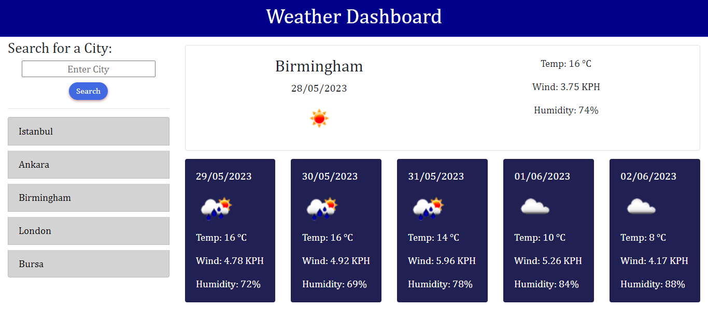

# Five-day-weather
This weather dashboard provides real-time and upcoming weather conditions for the city searched by the user.
This app will run in the browser, and will feature dynamically updated HTML and CSS powered by JavaScript. 
## User Story
AS A traveler
I WANT to see the weather outlook for multiple cities
SO THAT I can plan a trip accordingly
## Acceptance Criteria

Create a weather dashboard with form inputs.

When a user searches for a city they are presented with current and future conditions for that city and that city is added to the search history.

When a user views the current weather conditions for that city they are presented with:

The city name, the date, an icon representation of weather conditions, the temperature, the humidity, the wind speed.

When a user views future weather conditions for that city they are presented with a 5-day forecast that displays:

The date, an icon representation of weather conditions, the temperature, the humidity.

When a user clicks on a city in the search history they are again presented with current and future conditions for that city.

## Link 

https://milkibeka.github.io/Five-day-weather/

## Screenshot

The following screenshot shows the web application's appearance:

## Credits
 For this coding quiz application starter codes (HTML) are provided by University of Birmingham Front-End & UX Skills Bootcamp. 
 
 https://openweathermap.org/forecast5 is the API source.
 
 Other than course materials https://youtu.be/6trGQWzg2AI is  used for general guidance to make the app.

Also https://getbootstrap.com/docs/4.6/getting-started/introduction/ is used to style the app.

 ## License

This code is available under the MIT license. See the LICENSE file for more info.